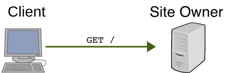
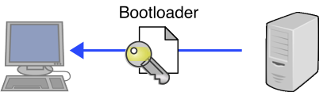
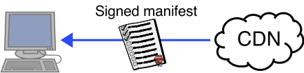
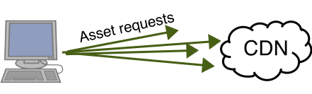
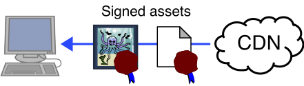
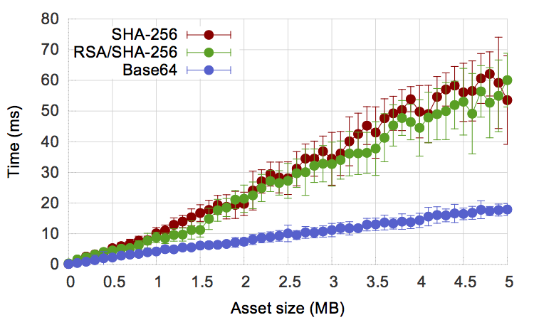

## What is it for?

The goal of Stickler is to provide end-to-end integrity protection for content
served to clients through a CDN. In particular, if the site owner correctly
deploys Stickler, a correct client will only execute JavaScript code signed by
the site owner and will only load site-owner-signed content into the DOM, even
in the presence of active attacks by the CDN.

Providing strong integrity guarantees for CDN-hosted content is critical
because integrity and confidentiality are closely linked. If the CDN can, for
example, insert JavaScript code into HTML pages served to web clients, the CDN
can read and exfiltrate passwords and other secret data via the client’s DOM.
By providing integrity guarantees, Stickler allows us to protect against
confidentiality attacks that a CDN can mount by serving maliciously modified
assets to the client.

## How does it work?

When a client browses to a Stickler-protected website (e.g., mysite.com), the
DNS record for the requested domain points the client to a web server
controlled by the site owner,
<em>not</em> by the CDN. The client makes a TLS connection to this server and
requests the index page for the website.  The site owner's web server returns
an HTML page with the Stickler bootloader script embedded. This script contains
(1) the site owner’s public signature verification key, (2) JavaScript code to
download and verify the site's assets, and (3) the location of the site's
manifest file. Since this first request is made over a TLS-authenticated
connection directly to the site owner’s server, authenticating the connection
is sufficient to authenticate the content. The site owner never needs to share
the public-key certificate it uses to authenticate this initial connection.

When the client executes the bootloader script, the script initiates an XHR
request (i.e., AJAX request) to the CDN for the site's manifest file. Upon
receiving the site manifest, the bootloader script first checks that the
manifest carries a valid signature by the site owner, and then the bootloader
executes the manifest file as JavaScript.

Executing the manifest file causes the client to generate a series of XHR
requests to the CDN for the rest of the site's assets, each of which bears a
digital signature by the site owner. When the CDN serves these assets to the
client, the bootloader script verifies the site owner's signature on each asset
and then processes it by invoking a function defined in the manifest.
Typically, this processing just involves inserting the object into a
pre-specified location in the DOM. When the user interacts with the site (e.g.,
by clicking a link), this could trigger more remote asset loads and signature
verifications as needed to update the page content.

The site owner's server only need serve the initial bootloader script—the
client can request all of the site's other assets directly from the CDN.

  1. The client first fetches the site's index page.  
     
  
  2. The site server returns the Stickler bootloader code.  
     
  
  3. The bootloader script requests the manifest via XHR.  
     
  
  4. The CDN serves the signed manifest file.  
     
  
  5. Executing the manifest causes the client to request the rest of the assets.  
     
  
  6. The CDN serves the signed site assets (images, videos, etc.) to the client.  
     

## How _well_ does it work?

The latency of loading an asset with Stickler is governed by three factors.
After the asset is retrieved from the network, Stickler must verify either the
signature or hash of the content. Finally, if the asset is an image or other
media, Stickler must convert it to a data uri and load it in a DOM element’s
src attribute.

The site developer can choose for each asset whether to sign and verify the
signature client-side, or embed a hash of the contents in the manifest, and
verify that the contents matches that hash client-side. Signatures are more
flexible in that they do not require the developer to commit to the specific
content. Instead, the site can generate content dynamically. Hashes, on the
other hand can be used for assets retrieved from another server (e.g.
third-party JavaScript or CSS).

Our experiments show that for small assets, both
signature and hash verification completes in under 1ms. For larger assets,
traversing the contents dominates performance and there is no measurable
difference between signing and hashing. Verifying the 5MB asset takes
approximately 55ms in both cases. In general, verification in either method
constitutes about a 1% overhead compared to downloaded that asset over a 10Mbps
network connection.

